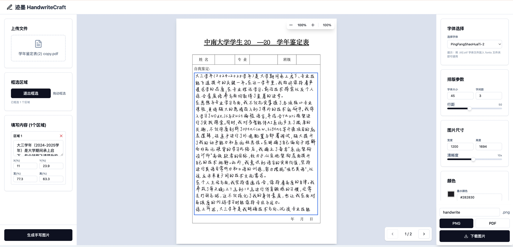

<div align="center">

# ✍️ 迹墨 HandwriteCraft

[](https://www.python.org/)
[](https://nextjs.org/)
[](https://www.typescriptlang.org/)
[](LICENSE)

**将文本转换为逼真的手写体图片，支持 PDF/图片背景**

[在线演示](https://your-demo-link.com) · [功能特性](#-功能特性) · [快速开始](#-快速开始) · [使用文档](#-使用文档)

</div>

---

## 📖 简介

**迹墨 (HandwriteCraft)** 是一个基于 Web 的智能手写生成工具，如墨迹般自然流畅，将普通文本转换为逼真的手写体效果。

> 「迹」为笔迹，「墨」为墨迹。以墨为媒，留迹于纸。

支持在 PDF 或图片上添加手写文字，适用于填写表格、制作手写笔记等场景。

### 效果展示

<div align="center">



*迹墨主界面 - 上传 PDF、框选区域、生成手写效果*

</div>

---

## ✨ 功能特性

| 功能 | 描述 |
|------|------|
| 📝 **手写生成** | 使用 Handright 库模拟真实手写效果 |
| 📄 **PDF 支持** | 上传 PDF 并在指定位置添加手写文字 |
| 🖼️ **图片支持** | 支持 JPG/PNG 作为背景 |
| 🎨 **参数调节** | 字体大小、字间距、行距、墨水颜色 |
| ✨ **手写风格** | 字体波动、行距波动、倾斜度调节 |
| 🔍 **高清输出** | 最高 20 倍超采样，抗锯齿处理 |
| 📐 **区域框选** | 可视化拖动选择填写区域 |
| 💾 **多种格式** | 支持 PNG 和 PDF 导出 |

---

## 🚀 快速开始

### 环境要求

- **Python** 3.8+
- **Node.js** 18+
- **npm** 或 **yarn**

### 安装步骤

#### 1. 克隆项目

```bash
git clone https://github.com/Eyjafjallaaa/HandwriteCraft.git
cd HandwriteCraft
```

#### 2. 安装 Python 依赖

```bash
cd backend
pip install -r requirements.txt
```

#### 3. 安装前端依赖

```bash
cd ../frontend
npm install
```

#### 4. 启动开发服务器

```bash
npm run dev
```

访问 http://localhost:3000 开始使用！

---

## 📂 项目结构

```
HandwriteCraft/
├── 📁 backend/                 # Python 后端
│   ├── src/
│   │   ├── handwrite_generator.py   # 手写生成核心
│   │   └── pdf_to_image.py          # PDF 处理工具
│   ├── requirements.txt
│   └── README.md
│
├── 📁 frontend/                # Next.js 前端
│   ├── src/
│   │   ├── app/                # 页面和 API 路由
│   │   ├── components/ui/      # UI 组件
│   │   └── lib/                # 工具函数
│   └── public/fonts/           # 字体文件（符号链接）
│
├── 📁 assets/                  # 静态资源
│   ├── fonts/                  # 字体文件
│   └── templates/              # 背景模板
│
├── 📁 output/                  # 生成的输出文件
└── 📁 tests/                   # 测试文件
```

---

## 📖 使用文档

### Web 界面使用

1. **上传文件** - 点击上传区域选择 PDF 或图片
2. **框选区域** - 点击「开始框选」，在页面上拖动选择需要填写的区域
3. **填写内容** - 在左侧面板输入每个区域的文字内容
4. **调整参数** - 在右侧调节字体大小、行距、手写风格等
5. **生成预览** - 点击「生成手写图片」查看效果
6. **下载文件** - 选择 PNG 或 PDF 格式下载

### 添加自定义字体

将 `.ttf` 或 `.otf` 字体文件放入 `assets/fonts/` 目录：

```bash
cp your-font.ttf assets/fonts/
```

刷新页面后即可在字体选择器中看到新字体。

### 命令行使用

```bash
cd backend/src

# 基本用法
python handwrite_generator.py --text "你好世界" --output ../../output/result.png

# 从文件读取
python handwrite_generator.py --text-file input.txt --output ../../output/result.png

# 自定义参数
python handwrite_generator.py \
  --text "手写文字" \
  --font-size 40 \
  --line-spacing 60 \
  --ink-color "#000000" \
  --quality 5 \
  --output ../../output/result.png
```

#### 命令行参数

| 参数 | 类型 | 默认值 | 说明 |
|------|------|--------|------|
| `--text` | string | - | 要转换的文字内容 |
| `--text-file` | string | - | 从文件读取文字 |
| `--font` | string | 系统默认 | 字体文件路径 |
| `--font-size` | int | 36 | 字体大小 |
| `--line-spacing` | int | 55 | 行距 |
| `--word-spacing` | int | 3 | 字间距 |
| `--width` | int | 1200 | 输出图片宽度 |
| `--height` | int | 1600 | 输出图片高度 |
| `--quality` | int | 3 | 清晰度（超采样倍率） |
| `--ink-color` | string | #282830 | 墨水颜色 |
| `--output` | string | output.png | 输出文件路径 |

---

## 🛠️ 技术栈

<div align="center">

| 类别 | 技术 |
|------|------|
| **前端** | Next.js · React · TypeScript · Tailwind CSS · shadcn/ui |
| **后端** | Next.js API Routes |
| **手写生成** | Python · Handright · OpenCV · Pillow |
| **PDF 处理** | PyMuPDF (fitz) |

</div>

---

## 🤝 贡献指南

欢迎提交 Issue 和 Pull Request！

1. Fork 本项目
2. 创建你的特性分支 (`git checkout -b feature/AmazingFeature`)
3. 提交更改 (`git commit -m 'Add some AmazingFeature'`)
4. 推送到分支 (`git push origin feature/AmazingFeature`)
5. 打开 Pull Request

---

## 📝 许可证

本项目采用 [MIT](LICENSE) 许可证。

---

<div align="center">

**[⬆ 回到顶部](#-迹墨-handwritecraft)**

Made with Vincent Deng

</div>